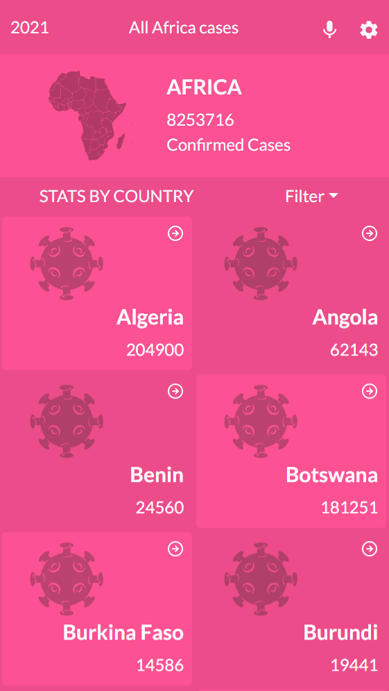
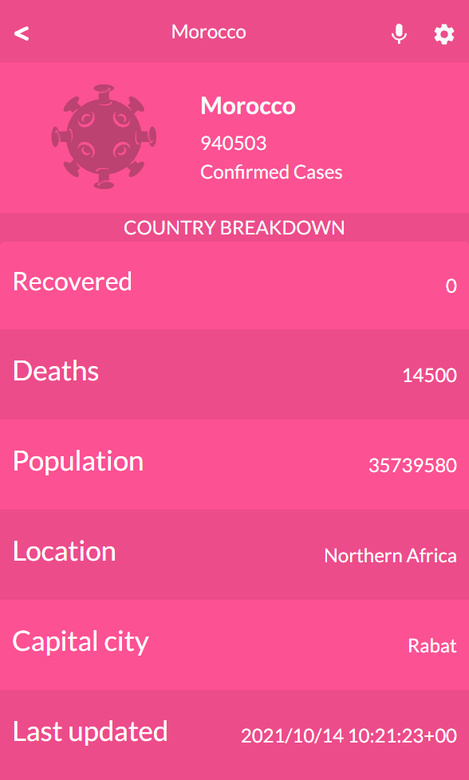

# COVID-19-Data-Tracker
> A mobile web application that collects information from an API to provide comprehensive data for the novel coronavirus in Africa. Real live data is obtained from the MMediaGroup API.

### Home page

### Details page

## Built With

- ReactJS
- Redux
- React Bootstrap

## Live demo

[COVID-19-Data-Tracker](https://covid-19-data-tracker-zee.netlify.app/)

## Getting Started

### To get a local copy run the following steps:

- Copy this link `https://github.com/ZeenatLawal/COVID-19-Data-Tracker.git`
- Open your terminal or command line
- Run `git clone` and paste the link
- Open the folder with your code editor
- Create a branch to work on
- Run `npm install`
- Run `npm start` to launch the server.
- Run `npm test` to run all tests.

## Authors

👤 **Zeenat Lawal**

- GitHub: [@ZeenatLawal](https://github.com/ZeenatLawal)
- Twitter: [@lawal_zeenat](https://twitter.com/lawal_zeenat)
- LinkedIn: [Zeenat Lawal](https://www.linkedin.com/in/zeenatlawal/)

## 🤝 Contributing

Contributions, issues, and feature requests are welcome!

Feel free to check the [issues page](https://github.com/ZeenatLawal/COVID-19-Data-Tracker/issues).

## Show your support

Give a ⭐️ if you like this project!

## Acknowledgments

- Learning partners, Standup and morning session team
- [Nelson Sakwa on Behance](https://www.behance.net/sakwadesignstudio) (Project Design from [Behance](https://www.behance.net/gallery/31579789/Ballhead-App-(Free-PSDs)))
- [M-Media-Group/Covid-19-API](https://github.com/M-Media-Group/Covid-19-API)
